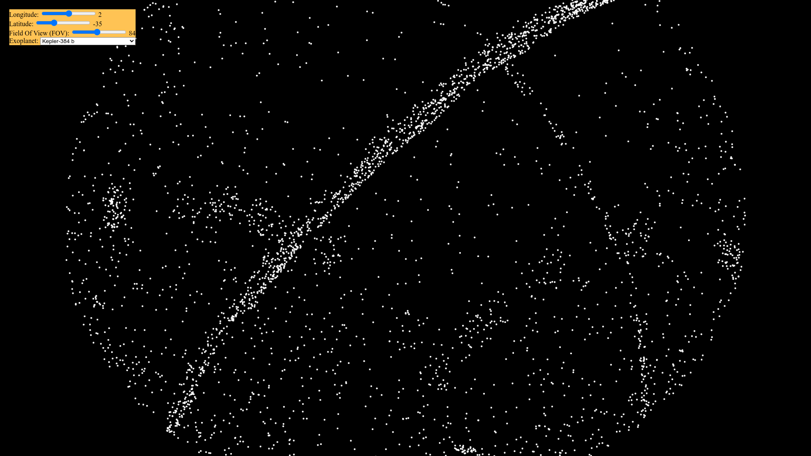

# Exosky Viewer
View the night sky from Earth and other exoplanets.\
See more [here](#the-program).

## Dependencies
Install [node.js](https://nodejs.org/en/download/).

## Running the code
Install the dependencies, then\
run the command `npm run all` in the terminal and then visit [`http://localhost:38712`](http://localhost:38712).

## Manually running
1. `npm i` to install all dependencies.
2. `npm run compile` to compile the code(or `npx webpack` to compile the front-end website code and `npx tsc` to compile the server backend).
3. `cd out/server`
4. `node backend` run the server.
5. Go to http://localhost:38712 

## The program
Upon loading in, you're previewing the night sky of Earth.

Move around by changing the latitude, latitude and fov angle by dragging the slider.

Change to another exoplanet by selecting a planet in the planets select menu. Note: you can't come back to Earth after switching to an exoplanet.

**Note**: there appears to be a few bugs with the projections. Some stars are missing and some latitudes don't work.

## Credits
Data from https://exoplanetarchive.ipac.caltech.edu/cgi-bin/TblView/nph-tblView?app=ExoTbls&config=PSCompPars 